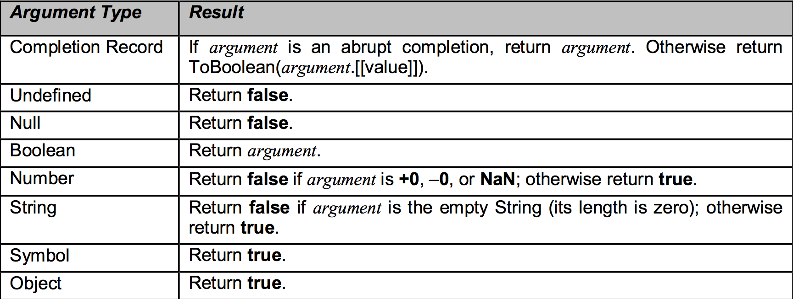
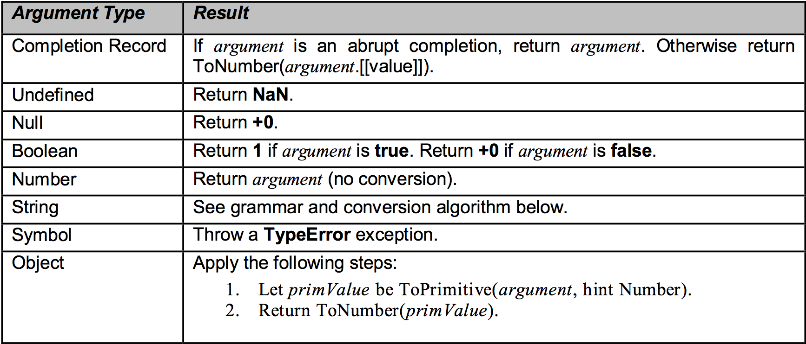

# 类型转化
ECMA规定了一套繁杂的隐式类型转化的方法，好处是熟练之后写的更快了，坏处是容易出错

类型转化其实就是一些人为规定的函数

## ToPrimitive ( input [, PreferredType] )

## ToBoolean ( argument )

## ToNumber ( argument )

String to Number 以后再说

## ToString
