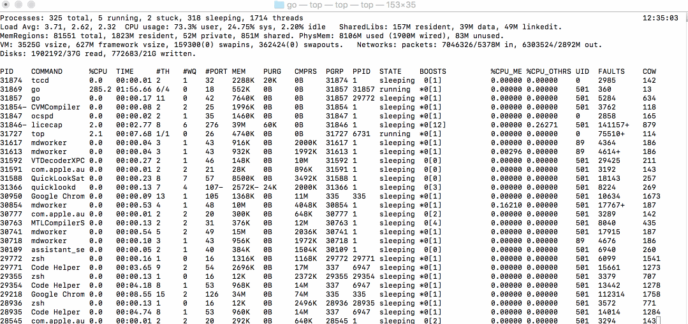

# 协程

之前在写程序的时候，突然想到了我们不一定要同回调的形式控制函数的流程。我们完全可以直接写顺序的代码，然后主动的分析他要不要阻塞？如果是阻塞的就把这断代码的CPU控制权交出去，执行其他代码。完全没必要显示的使用异步函数的形式，可以直接自己决定要不要交出CPU控制权。可以在网络通讯、文件读取，这种情况下交出CPU的控制权。然后呢，现在我感觉这种方式和协程特别像。携程它的特色就是在适当的时候主动的交出CPU控制区，协程之间共享栈内存。
而线程是在进程的时间分片上运行，独立的栈内存。

## 轻量级的线程
每个线程总是要执行，可能会浪费。
切换时要保存栈，很累

多个协程可以一个线程上运行

python可以 yeild 模拟协程

## CPU 占用
